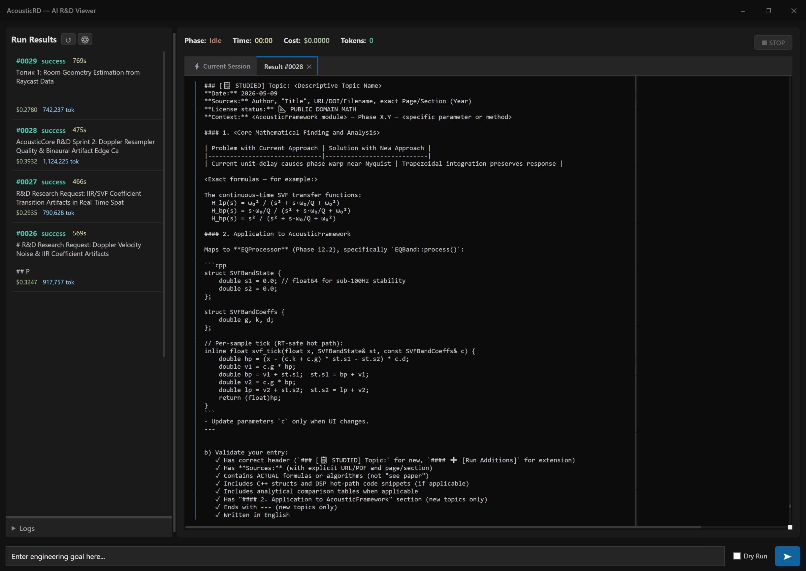
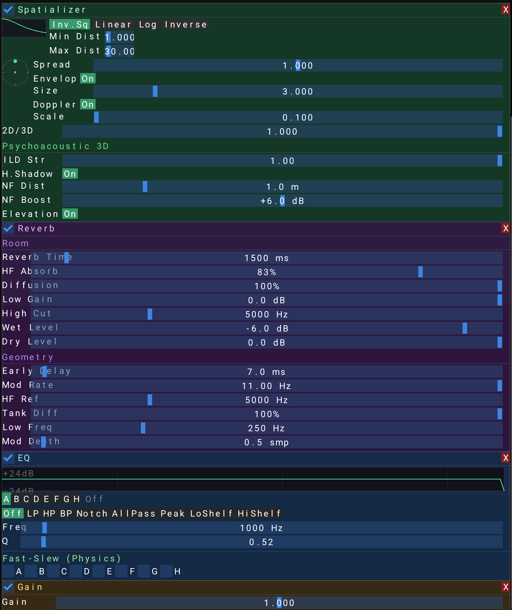

  <h1>Ivan Stepanov</h1>
  <h3>Lead Technical Sound Designer & Audio Programmer</h3>
  

    Bridging creative audio production with AAA technical architecture. 
    Specializing in advanced C# audio architectures for Unity, procedural acoustic systems, custom C++ DSP engines, and AI tools for pipeline optimization.
  

  

    
    
    <!-- Link to your new Interactive Portfolio -->
    
  

 

  
### Tech Stack & Audio Middleware
| Core Engineering | Audio Middleware | Workflow & AI R&D |
| :--- | :--- | :--- |
|     |     |     |

 

### Featured Engineering Projects
#### 1. Procedural Acoustics & Volumetric Occlusion
**Stack:** `Unity` `C#` `FMOD` `Raycasting` `Fibonacci Sampling`
> *Automated environmental audio system that removes the need for manual Reverb Zones placement.*
<table>
<tr>
<td width="55%">
 
This system allows sound sources to "hear" the geometry around them.
  
<ul>
    <li><b>Volumetric Raycasting:</b> Real-time calculation of diffraction and occlusion based on player position and geometry.</li>
    <li><b>Room Scanning:</b> Uses Fibonacci Sphere Sampling to dynamically calculate Room Size and Reverb Amount.</li>
    <li><b>Smart Filtering:</b> Prevents false occlusion when close to walls using proximity logic.</li>
    <li><b>Result:</b> Level designers simply drop the prefab, and acoustics work automatically.</li>
</ul>
 

</td>
<td width="45%">
    
</td>
</tr>
</table>
 

#### 2. AcousticRD: Autonomous AI R&D Pipeline
**Stack:** `Python` `CrewAI` `Anthropic Claude` `Data Parsing`
> *Multi-agent AI department automating hundreds of hours of academic DSP research.*
<table>
<tr>
<td width="55%">
 
Automates the synthesis of commercial DSP mathematics and software engineering references.
  
<ul>
    <li><b>Autonomous Research:</b> Agents dynamically read academic papers and synthesize production-ready C++ specifications.</li>
    <li><b>"Clean Room" IP Protection:</b> Automatically filters out viral licenses, extracting only uncopyrightable algorithms to ensure production safety.</li>
    <li><b>Tailored Mapping:</b> Translates complex math directly into the studio's native C++ architecture constraints.</li>
</ul>
 
<i>(Internal tooling, methodology showcased in portfolio)</i>
</td>
<td width="45%">
    
</td>
</tr>
</table>
 

#### 3. AcousticFramework: Custom C++ DSP Kernel
**Stack:** `C++` `System Architecture` `Lock-Free Concurrency` `DSP Math`
> *A proprietary AAA-grade C++ audio architecture built from scratch for absolute technical control.*
<table>
<tr>
<td width="55%">
 
Engineered to bypass third-party bottlenecks and deliver flawless real-time audio performance.
  
<ul>
    <li><b>Zero-Allocation Architecture:</b> Strictly lock-free C++ memory design ensuring O(1) processing time with zero frame drops.</li>
    <li><b>Bespoke DSP Modules:</b> Custom mathematical implementations of Spatializers and equalizers tailored for game audio.</li>
    <li><b>LiveSync Protocol:</b> Native UDP integration allowing real-time DSP manipulation and auditioning via custom tooling.</li>
</ul>
 
<i>(Core engine is private, high-level architecture discussed in portfolio)</i>
</td>
<td width="45%">
    
</td>
</tr>
</table>
 

